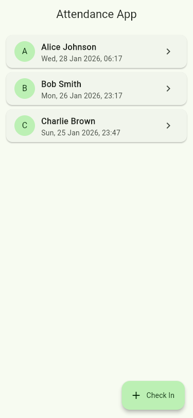
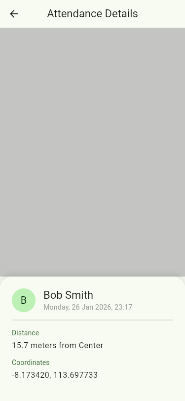

# Attendance App

A robust, location-based attendance tracking application built with **Flutter**. This app allows users to check in within a specific geofenced area, viewing their attendance history and details.

## 📱 Features

*   **Location-Based Check-In**: Uses GPS to verify if the user is within the allowed radius of the office/site.
*   **Geofencing Visualization**: Visualizes the allowed attendance zone and user location on Google Maps.
*   **Attendance History**: View a list of past check-ins with timestamps.
*   **Detail View**: Drill down into specific attendance records to see exact location and time.
*   **Offline Support**: Data is persisted locally using SQLite (`sqflite`).
*   **Modern UI**: Designed with Material 3 principles for a clean and accessible user experience.

## 📥 Download

**Android APK**: [Download Android APK](releases/app-release.apk)

> **Note for iOS**: Building the iOS application requires macOS and Xcode. Please clone the repository and run `flutter build ios` on a Mac to generate the app.

## 🛠️ Tech Stack & Architecture

*   **Framework**: Flutter (Dart)
*   **State Management**: GetX (Service-Repository-Controller Pattern)
*   **Local Database**: Sqflite
*   **Maps & Location**: `google_maps_flutter`, `geolocator`
*   **Architecture**:
    *   **Services**: Handle external data sources (Location, Database, Notifications).
    *   **Repositories**: Abstract data access logic.
    *   **Controllers**: Manage business logic and state.
    *   **Bindings**: Dependency Injection setup.

## 📸 Screenshots

| Home Screen | Check In | Detail View |
|:---:|:---:|:---:|
|  |  |  |

## 🚀 Getting Started

1.  **Clone the repository**:
    ```bash
    git clone https://github.com/yourusername/attendance-app.git
    ```

2.  **Install Dependencies**:
    ```bash
    flutter pub get
    ```

3.  **Run the App**:
    ```bash
    flutter run
    ```

## 🧪 Testing

This project includes unit tests for Controllers and Repositories.

To run tests:
```bash
flutter test
```

## 📝 License

This project is licensed under the MIT License.
